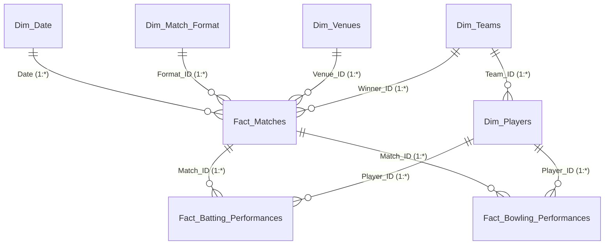

# ICC Global Cricket Analytics | Power BI Desktop Master Setup Guide & DAX Blueprint

This master guide provides complete instructions to build, model, and visualize an executive-tier **ICC Global Cricket Analytics Dashboard** in **Microsoft Power BI Desktop**.

---

## 1. Data Model Architecture (Star Schema)

The dataset is partitioned into **Fact Tables** (high-volume transactional event logs) and **Dimension Tables** (contextual descriptive entities).

### Table Inventory (Located in `data/` folder)

| Table Name | Type | Key Columns | Description |
| :--- | :--- | :--- | :--- |
| `Dim_Teams` | Dimension | `Team_ID` | Top 12 international cricket nations with ICC ranks, continents, and primary brand hex colors |
| `Dim_Players` | Dimension | `Player_ID`, `Team_ID` | 44+ international world-class players with playing roles, batting/bowling styles |
| `Dim_Venues` | Dimension | `Venue_ID` | 14 iconic global cricket grounds with capacities, pitch behaviors, and country |
| `Dim_Match_Format` | Dimension | `Format_ID` | Match specifications (T20I, ODI, Test) |
| `Dim_Date` | Dimension | `Date` | Continuous calendar date dimension (2022–2026) for Time Intelligence |
| `Fact_Matches` | Fact | `Match_ID`, `Date`, `Venue_ID`, `Format_ID` | Match outcomes, toss decisions, winner, win margins, totals, attendance |
| `Fact_Batting_Performances` | Fact | `Performance_ID`, `Match_ID`, `Player_ID` | Granular per-innings batting stats (Runs, Balls, 4s, 6s, SR, Dismissals) |
| `Fact_Bowling_Performances` | Fact | `Spell_ID`, `Match_ID`, `Player_ID` | Granular bowling spells (Overs, Maidens, Runs, Wickets, Economy, Dots) |

---

### Data Model Entity-Relationship Diagram



### Relationship Configuration in Power BI Model View

In Power BI Desktop, open the **Model View** tab and configure the following relationships:

1. `Dim_Date[Date]` ➔ `Fact_Matches[Date]`  
   - Cardinality: **1 to Many (1:*)**  
   - Cross-filter direction: **Single**  
   - Mark `Dim_Date` as a Date Table (Right-click `Dim_Date` ➔ *Mark as date table*).

2. `Dim_Match_Format[Format_ID]` ➔ `Fact_Matches[Format_ID]`  
   - Cardinality: **1 to Many (1:*)**  
   - Cross-filter direction: **Single**

3. `Dim_Venues[Venue_ID]` ➔ `Fact_Matches[Venue_ID]`  
   - Cardinality: **1 to Many (1:*)**  
   - Cross-filter direction: **Single**

4. `Dim_Teams[Team_ID]` ➔ `Fact_Matches[Winner_ID]` (Active)  
   - Cardinality: **1 to Many (1:*)**  
   - Cross-filter direction: **Single**

5. `Dim_Teams[Team_ID]` ➔ `Fact_Matches[Team1_ID]` (Inactive Relationship)  
6. `Dim_Teams[Team_ID]` ➔ `Fact_Matches[Team2_ID]` (Inactive Relationship)  

7. `Fact_Matches[Match_ID]` ➔ `Fact_Batting_Performances[Match_ID]`  
   - Cardinality: **1 to Many (1:*)**  
   - Cross-filter direction: **Both** (or Single if using CALCULATE)

8. `Dim_Players[Player_ID]` ➔ `Fact_Batting_Performances[Player_ID]`  
   - Cardinality: **1 to Many (1:*)**  
   - Cross-filter direction: **Single**

9. `Fact_Matches[Match_ID]` ➔ `Fact_Bowling_Performances[Match_ID]`  
   - Cardinality: **1 to Many (1:*)**  
   - Cross-filter direction: **Both**

10. `Dim_Players[Player_ID]` ➔ `Fact_Bowling_Performances[Player_ID]`  
    - Cardinality: **1 to Many (1:*)**  
    - Cross-filter direction: **Single**

---

## 2. Dedicated Measures Table Setup

Create an empty table named `_Measures` to house all DAX formulas cleanly:
1. In the **Home** tab, click **Enter Data**.
2. Name the table `_Measures` and click **Load**.
3. Add the measures below. Once at least one measure is added, delete the default dummy column `Column1`.

---

## 3. Production DAX Measure Library (Organized by Folders)

### Folder 1: Core Fact & Volume Measures

#### Measure 1: Total Matches
```dax
Total Matches = 
COUNTROWS(Fact_Matches)
```

#### Measure 2: Total Runs Scored
```dax
Total Runs Scored = 
SUM(Fact_Matches[Total_Runs])
```

#### Measure 3: Total Wickets Fallen
```dax
Total Wickets Fallen = 
SUM(Fact_Matches[Total_Wickets])
```

#### Measure 4: Average First Innings Runs
```dax
Avg First Innings Score = 
AVERAGE(Fact_Matches[Team1_Runs])
```

#### Measure 5: Total Boundaries
```dax
Total Boundaries = 
SUM(Fact_Batting_Performances[Fours]) + SUM(Fact_Batting_Performances[Sixes])
```

#### Measure 6: Total Match Attendance
```dax
Total Attendance = 
SUM(Fact_Matches[Attendance])
```

---

### Folder 2: Win-Loss & Toss Analytics

#### Measure 7: Total Wins (Selected Team)
```dax
Total Wins = 
CALCULATE(
    COUNTROWS(Fact_Matches),
    USERELATIONSHIP(Fact_Matches[Winner_ID], Dim_Teams[Team_ID])
)
```

#### Measure 8: Total Matches Played (Selected Team)
```dax
Total Matches Played = 
VAR CurrentTeam = SELECTEDVALUE(Dim_Teams[Team_ID])
RETURN
    CALCULATE(
        COUNTROWS(Fact_Matches),
        ALL(Fact_Matches),
        Fact_Matches[Team1_ID] = CurrentTeam || Fact_Matches[Team2_ID] = CurrentTeam
    )
```

#### Measure 9: Win Percentage (%)
```dax
Win Percentage = 
DIVIDE([Total Wins], [Total Matches Played], 0)
```

#### Measure 10: Chasing Win Rate (%)
```dax
Chasing Win % = 
VAR ChasedAndWon = 
    CALCULATE(
        COUNTROWS(Fact_Matches),
        Fact_Matches[Winner_ID] = Fact_Matches[Second_Batting_Team_ID]
    )
RETURN 
    DIVIDE(ChasedAndWon, [Total Matches], 0)
```

#### Measure 11: Defending Win Rate (%)
```dax
Defending Win % = 
VAR DefendedAndWon = 
    CALCULATE(
        COUNTROWS(Fact_Matches),
        Fact_Matches[Winner_ID] = Fact_Matches[First_Batting_Team_ID]
    )
RETURN 
    DIVIDE(DefendedAndWon, [Total Matches], 0)
```

#### Measure 12: Toss Win to Match Win Correlation
```dax
Toss Win to Match Win % = 
VAR WonTossAndMatch = 
    CALCULATE(
        COUNTROWS(Fact_Matches),
        Fact_Matches[Toss_Winner_ID] = Fact_Matches[Winner_ID]
    )
RETURN 
    DIVIDE(WonTossAndMatch, [Total Matches], 0)
```

---

### Folder 3: Batting Mastery & Aggression

#### Measure 13: Batter Total Runs
```dax
Batter Runs = 
SUM(Fact_Batting_Performances[Runs_Scored])
```

#### Measure 14: Batter Balls Faced
```dax
Batter Balls Faced = 
SUM(Fact_Batting_Performances[Balls_Faced])
```

#### Measure 15: Batting Strike Rate
```dax
Batting Strike Rate = 
DIVIDE([Batter Runs] * 100, [Batter Balls Faced], 0)
```

#### Measure 16: Batter Dismissals
```dax
Batter Dismissals = 
SUM(Fact_Batting_Performances[Is_Out])
```

#### Measure 17: Batting Average
```dax
Batting Average = 
DIVIDE([Batter Runs], [Batter Dismissals], [Batter Runs])
```

#### Measure 18: Total Fours (4s)
```dax
Total Fours = 
SUM(Fact_Batting_Performances[Fours])
```

#### Measure 19: Total Sixes (6s)
```dax
Total Sixes = 
SUM(Fact_Batting_Performances[Sixes])
```

#### Measure 20: Boundary Run Contribution %
```dax
Boundary Run % = 
VAR BoundaryRuns = ([Total Fours] * 4) + ([Total Sixes] * 6)
RETURN 
    DIVIDE(BoundaryRuns, [Batter Runs], 0)
```

#### Measure 21: Century Count (100s)
```dax
Centuries Count = 
CALCULATE(
    COUNTROWS(Fact_Batting_Performances),
    Fact_Batting_Performances[Milestone] = "Century"
)
```

#### Measure 22: Half-Century Count (50s)
```dax
Fifties Count = 
CALCULATE(
    COUNTROWS(Fact_Batting_Performances),
    Fact_Batting_Performances[Milestone] = "Half-Century"
)
```

#### Measure 23: Player of the Match Count
```dax
POTM Awards = 
VAR CurrentPlayer = SELECTEDVALUE(Dim_Players[Player_ID])
RETURN
    CALCULATE(
        COUNTROWS(Fact_Matches),
        Fact_Matches[Player_Of_Match_ID] = CurrentPlayer
    )
```

---

### Folder 4: Bowling Lethality & Economy

#### Measure 24: Total Wickets Taken
```dax
Total Wickets = 
SUM(Fact_Bowling_Performances[Wickets_Taken])
```

#### Measure 25: Overs Bowled
```dax
Total Overs Bowled = 
SUM(Fact_Bowling_Performances[Overs_Bowled])
```

#### Measure 26: Bowling Runs Conceded
```dax
Bowling Runs Conceded = 
SUM(Fact_Bowling_Performances[Runs_Conceded])
```

#### Measure 27: Bowling Economy Rate
```dax
Bowling Economy Rate = 
DIVIDE([Bowling Runs Conceded], [Total Overs Bowled], 0)
```

#### Measure 28: Bowling Average
```dax
Bowling Average = 
DIVIDE([Bowling Runs Conceded], [Total Wickets], BLANK())
```

#### Measure 29: Bowling Strike Rate
```dax
Bowling Strike Rate = 
VAR TotalBalls = [Total Overs Bowled] * 6
RETURN
    DIVIDE(TotalBalls, [Total Wickets], BLANK())
```

#### Measure 30: Total Dot Balls
```dax
Total Dot Balls = 
SUM(Fact_Bowling_Performances[Dot_Balls])
```

#### Measure 31: Dot Ball %
```dax
Dot Ball % = 
VAR TotalBalls = [Total Overs Bowled] * 6
RETURN 
    DIVIDE([Total Dot Balls], TotalBalls, 0)
```

#### Measure 32: 5-Wicket Hauls (Fifers)
```dax
Five Wicket Hauls = 
CALCULATE(
    COUNTROWS(Fact_Bowling_Performances),
    Fact_Bowling_Performances[Fifer_Haul] = 1
)
```

---

### Folder 5: Time Intelligence (YoY & Cumulative)

#### Measure 33: Total Runs Prior Year (PY)
```dax
Total Runs PY = 
CALCULATE(
    [Total Runs Scored],
    SAMEPERIODLASTYEAR(Dim_Date[Date])
)
```

#### Measure 34: Runs YoY Growth %
```dax
Runs YoY Growth % = 
VAR CurrentRuns = [Total Runs Scored]
VAR PriorRuns = [Total Runs PY]
RETURN 
    DIVIDE(CurrentRuns - PriorRuns, PriorRuns, 0)
```

#### Measure 35: Running Total Runs YTD
```dax
Runs YTD = 
TOTALYTD([Total Runs Scored], Dim_Date[Date])
```

---

### Folder 6: Conditional Formatting (Dynamic Hex Colors)

#### Measure 36: Win Rate Color Hex Code
```dax
Win Rate KPI Color = 
SWITCH(
    TRUE(),
    [Win Percentage] >= 0.65, "#10B981", /* Elite - Vibrant Emerald */
    [Win Percentage] >= 0.50, "#F59E0B", /* Competitive - Gold */
    "#EF4444"                           /* Sub-par - Coral Red */
)
```

#### Measure 37: Economy Rate Color Hex Code
```dax
Economy KPI Color = 
SWITCH(
    TRUE(),
    [Bowling Economy Rate] <= 6.50, "#10B981", /* Restrictive */
    [Bowling Economy Rate] <= 8.20, "#38BDF8", /* Average */
    "#EF4444"                                 /* Expensive */
)
```

---

## 4. Visual Layout & Page Blueprint (1920 x 1080)

Apply the included theme file `cricket_theme.json` via **View ➔ Themes ➔ Browse for themes**.

### Page 1: Executive Match Overview
- **Top Slicer Bar (Y: 20, Height: 60)**:
  - Format Slicer (Tile / Chiclet: All, T20I, ODI, Test)
  - Year Slicer (Dropdown: 2022 to 2026)
  - Tournament Slicer (Dropdown)
- **KPI Card Row (Y: 90, Height: 120, 5 Cards)**:
  - Card 1: `[Total Matches]`
  - Card 2: `[Total Runs Scored]`
  - Card 3: `[Total Wickets Fallen]`
  - Card 4: `[Avg First Innings Score]`
  - Card 5: `[Total Boundaries]`
- **Visual Left (Y: 230, Width: 1100, Height: 400)**:
  - Visual: Clustered Bar Chart (Horizontal)
  - Y-Axis: `Dim_Teams[Team_Name]`
  - X-Axis: `[Win Percentage]`
  - Data Colors: Field Value based on `[Win Rate KPI Color]`
- **Visual Right (Y: 230, Width: 750, Height: 400)**:
  - Visual: Donut Chart
  - Legend: `Defended (Bat 1st Won)` vs `Chased (Bowl 1st Won)`
  - Values: `[Defending Win %]`, `[Chasing Win %]`
- **Bottom Visual (Y: 650, Width: 1870, Height: 380)**:
  - Visual: Area Chart
  - X-Axis: `Dim_Date[Year_Month]`
  - Y-Axis: `[Total Runs Scored]`, Tooltip: `[Runs YoY Growth %]`

### Page 2: Batting Masterclass
- **KPI Row (Y: 90, Height: 120)**:
  - Leading Scorer, Highest Individual Score, Most 6s, Total 100s
- **Top Visual Left**:
  - Clustered Bar Chart: Top 10 `Dim_Players[Player_Name]` by `[Batter Runs]`
- **Top Visual Right**:
  - Donut Chart: `Fact_Batting_Performances[Dismissal_Mode]` by Count
- **Center Visual**:
  - Scatter Chart:
    - X-Axis: `[Batter Runs]`
    - Y-Axis: `[Batting Strike Rate]`
    - Details: `Dim_Players[Player_Name]`
    - Legend: `Dim_Teams[Team_Name]`
- **Bottom Visual**:
  - Table Visual: Player, Team, Innings, Runs, Balls, Strike Rate, 4s, 6s, 100s, 50s

### Page 3: Bowling Dynamics
- **KPI Row**: Leading Wicket Taker, Best Bowling Spell, Lowest Economy, Dot Balls
- **Visuals**:
  - Clustered Bar: Top 10 Bowlers by `[Total Wickets]`
  - Clustered Column: Dot Balls by Bowler
  - Scatter Chart: `[Bowling Economy Rate]` (X-Axis) vs `[Bowling Strike Rate]` (Y-Axis)
  - Table: Bowler, Team, Overs, Wickets, Runs Conceded, Economy, Dot Balls, 5-fers

### Page 4: Venues & Pitch Conditions
- **Visuals**:
  - Clustered Bar: Stadiums by `[Avg First Innings Score]`
  - Donut Chart: Pitch Types (Pace, Spin, Batting Paradise, Seam)
  - 100% Stacked Bar: Stadium Toss Bias (`[Chasing Win %]` vs `[Defending Win %]`)

---

## 5. Quick-Start Ingestion Checklist in Power BI Desktop

1. **Launch Power BI Desktop**.
2. Click **Get Data** ➔ **Text/CSV**.
3. Select and import each of the 8 `.csv` files from the `data/` folder:
   - `Dim_Teams.csv`
   - `Dim_Players.csv`
   - `Dim_Venues.csv`
   - `Dim_Match_Format.csv`
   - `Dim_Date.csv`
   - `Fact_Matches.csv`
   - `Fact_Batting_Performances.csv`
   - `Fact_Bowling_Performances.csv`
4. Confirm columns in Power Query, then click **Close & Apply**.
5. Import theme: Go to **View** ➔ **Themes** ➔ **Browse for themes** ➔ Select `cricket_theme.json`.
6. Switch to **Model View** and verify the Star-Schema relationships as specified in Section 1.
7. Create table `_Measures` and paste the DAX code from Section 3.
8. Assemble the 4 visual canvas pages according to the blueprint.
